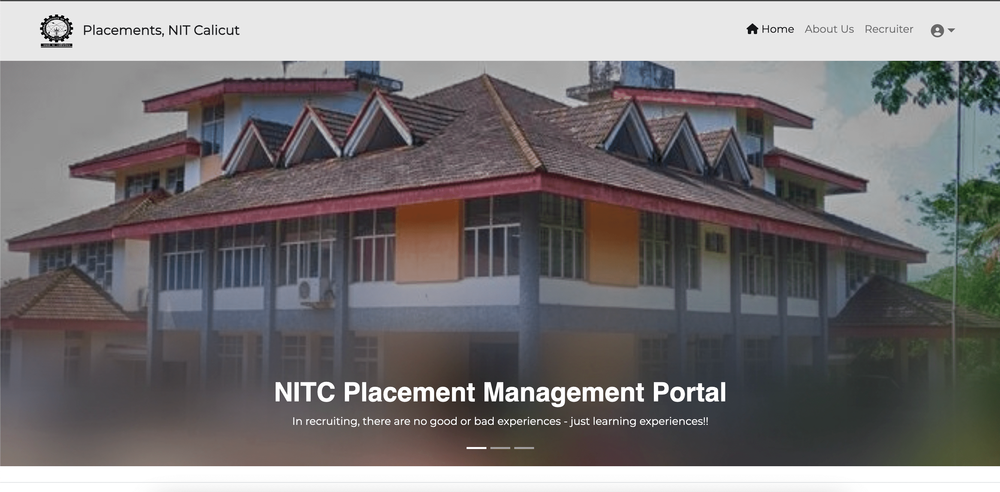
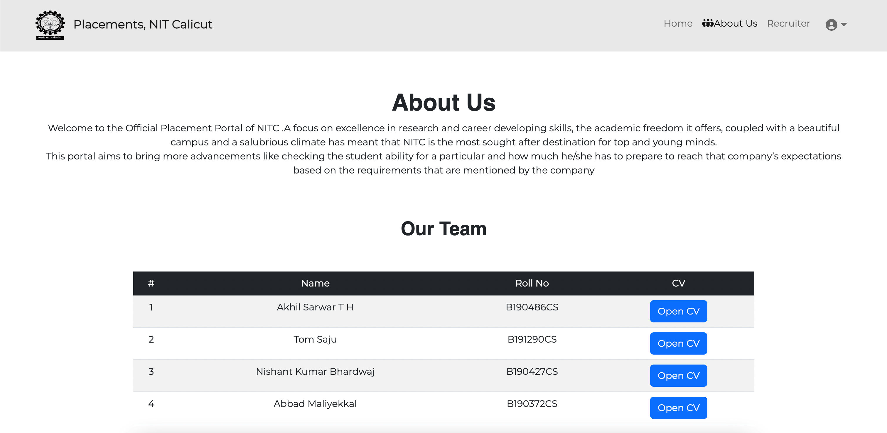
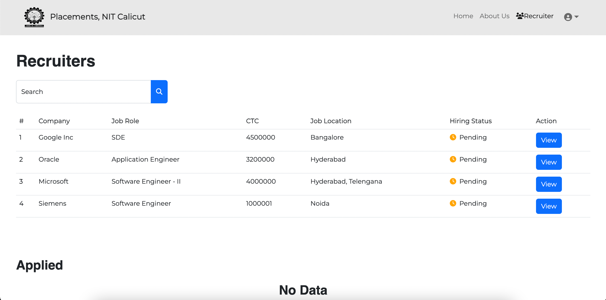
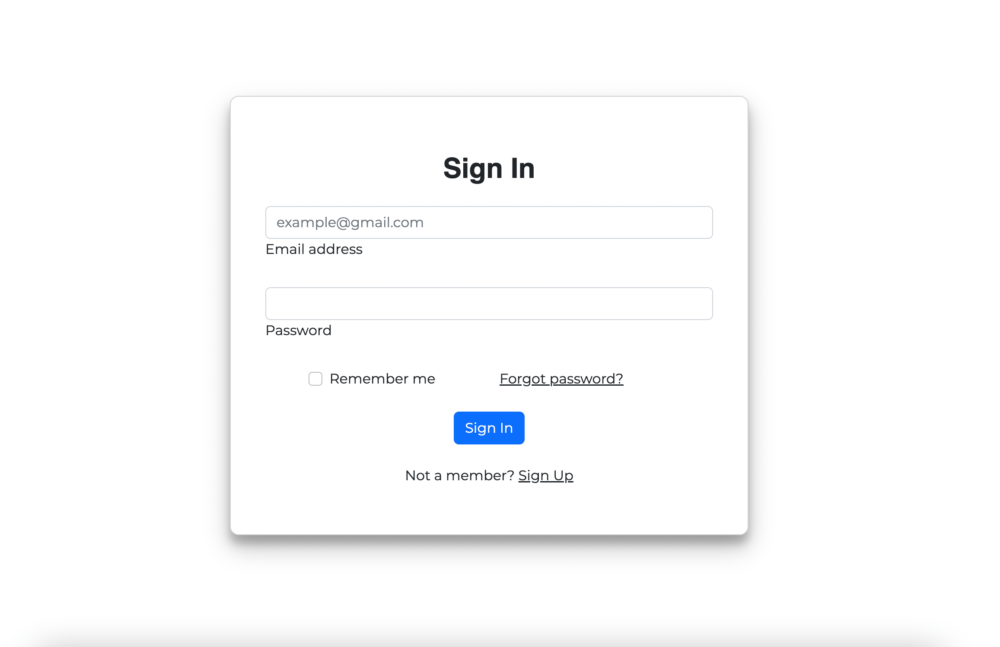
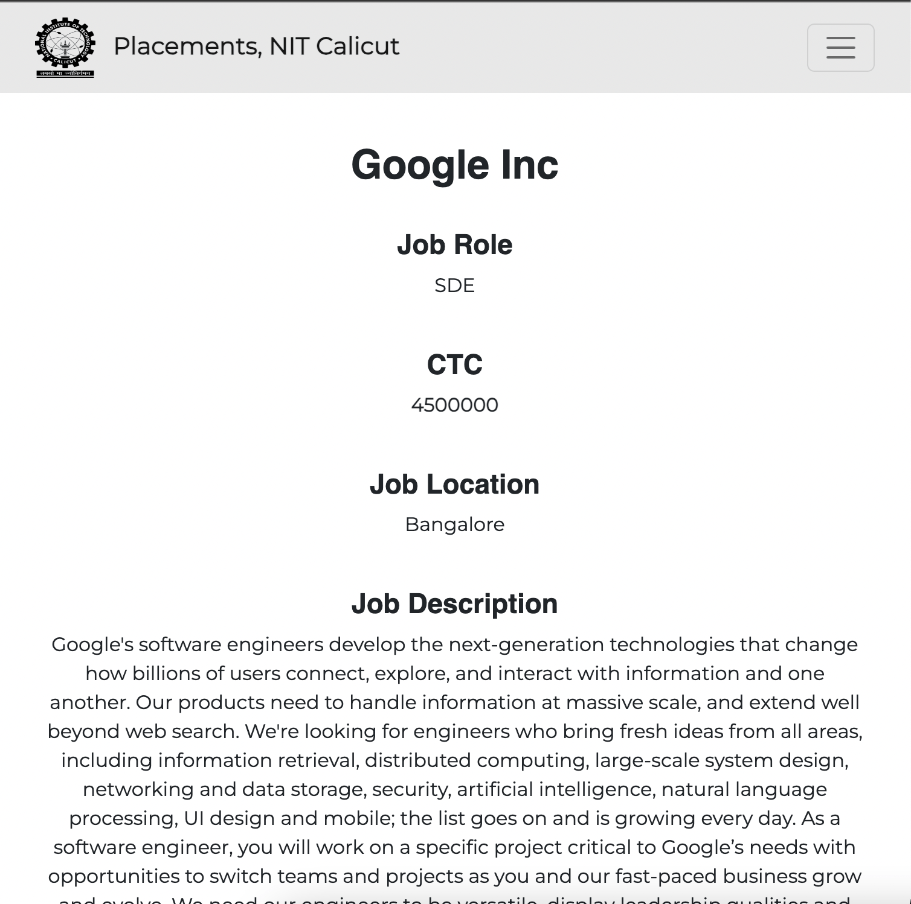
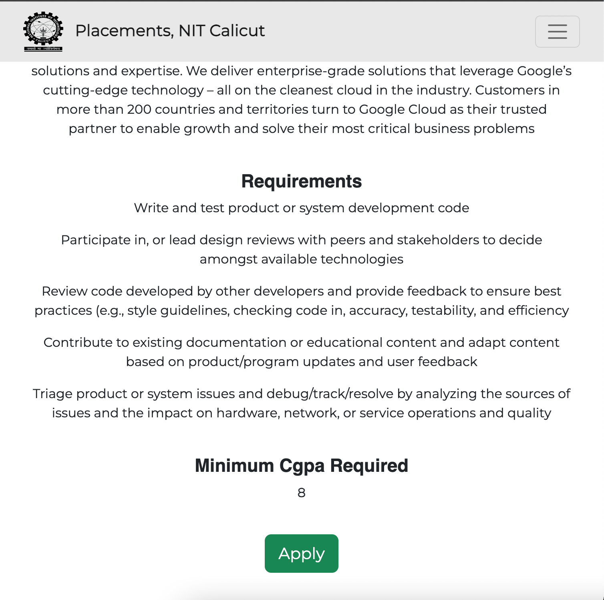

# NITC-Placement-Management-System


## Getting Started

- Install docker

- In the home app directory run
```
 docker compose rm -vf;
 docker compose up --build
```

- This will build all necessary images and start the docker containers

- The Web App can be accessed at http://localhost:3050

## About the Application

Nitc placement management system is a web application for managing placement related activities. Students can register in the application, fill up their details, apply for upcoming drives and get placed, hence securing their future.

### Functionalities
#### Student
- Signup/Login in the application
- Fill up their details and upload resume for the reference of recruiters
- Update their details (for eg: cgpa - which changes each semester)
- View Recruiter details and apply for drives which they are eligible based on their cgpa

#### Placement Coordinator
 - Signup/Login in the application, fill personal info
 - Add Recruiter details of upcoming recruiters so it is visible for the students
 - Change hiring status of a recruiter if they are done with the drive or delete recruiter
 - Change the student placed status after they are placed.

### Snapshots of the UI

|                           |                             |
| ----------------------------------- | ----------------------------------- |
|  |  |

|                           |                             |
| ----------------------------------- | ----------------------------------- |
|  |  |

|                           |                             |
| ----------------------------------- | ----------------------------------- |
|  |  |


